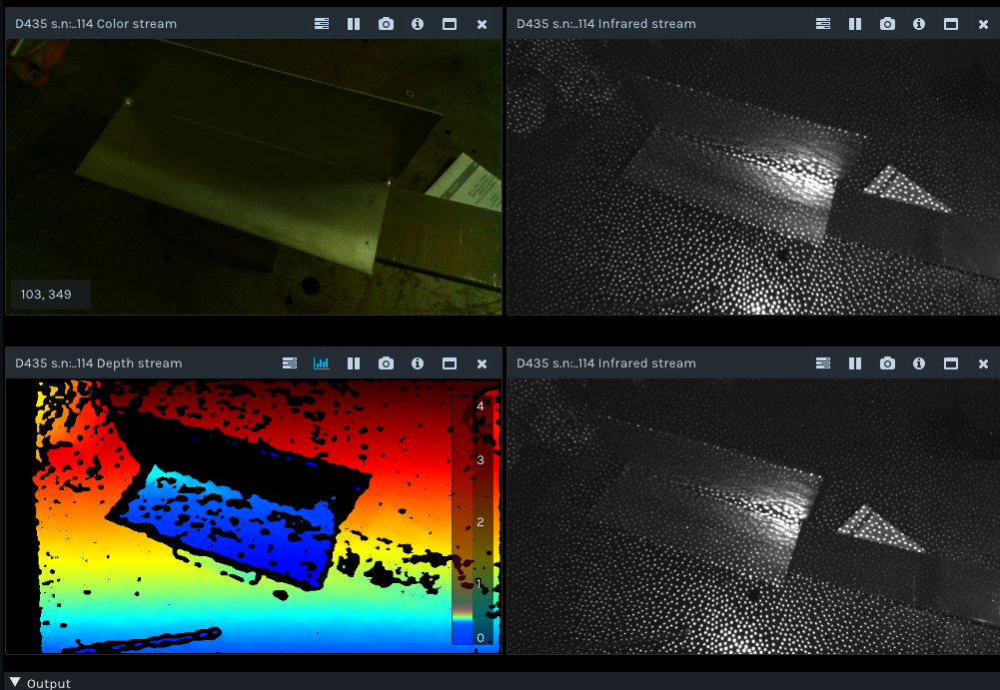

# Imaging Reflective Surfaces

This page will keep some of my notes on techniques to image highly reflective surfaces. While sophisticated filtering and reconstruction techniques can help without decent incoming images, you will not get high quality reconstructions.

## Specular Reflections from external lights
In this case I am using a Realsense D435 with is a stereo camera. It uses 2 monochrome sensors along with an optional 850nm pattern projector to create depth. 
### Changing Exposure and laser power
The problem is most significant when the camera is aligned such that an external light (in this case fluorescents) reflects directly off the surface being imaged and into the camera lens. In my experience, changing the exposure did not help much in this case. Increasing the power on the IR projector can help slightly, but then reflections from the IR projector become a problem. Further, in corners such as the one shown below, the projected pattern can cause inter-reflections that cause a ballooning effect below the surface. 

### Turning off external lights

This seems a bit like a cheat. However, obviously if you can turn off or block the external light source that is causing the reflection, this is ideal. These images were taken by turning off the room lights and using ambient light from adjacent room. With sufficient laser power, the surfaces look quite good. See the images below in order of increasing laser power

### Adding IR bandpass filter
This technique was suggested in the [Realsense tuning guide](https://www.intel.com/content/dam/support/us/en/documents/emerging-technologies/intel-realsense-technology/BKMs_Tuning_RealSense_D4xx_Cam.pdf) since turning off the external lights worked.

For this test, the filters were simply taped in front of each camera on the D435. There is not really a good way to mount them without taking it out of the factory case, but this should be sufficient to see what is going on. All of the images below were taken with the offending lights turned back on. In this case a Thor Labs FB850-10 bandpass filter was used. While the images aren't great you can see that with proper exposure and laser power, you can get good results with this. Basically all of the specular reflection from the fluorescent lights is gone. However, since I had no other source of 850nm light, I had to increase the laser power to get good images which cases inter-reflections from the laser projector itself. Further, the IR images are quite dark and the RGB is still blown out. This is an issue if you are using these images to colorize the resulting depth data.

### Conclusion

I think the ideal situation would be to add an IR filter to elimate external light and then artificially provide ambient 850nm light. Then I suspect a very low power pattern projection could be used (e.g. 30 out of 360 on the realsense) to help add a little texture since the parts are pretty smooth. However, if you use the pattern projection on high power, then you get inter-reflections of the pattern in corners which is not ideal. Another thing that we could try is using an external pattern projector, but I would imagine any direct lighting will have similar results.
